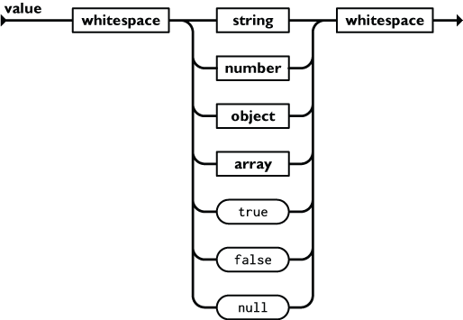
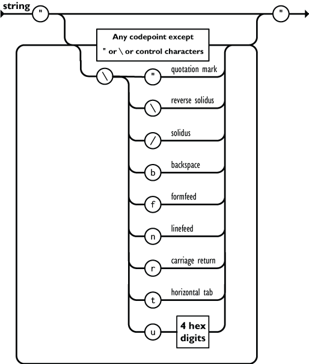
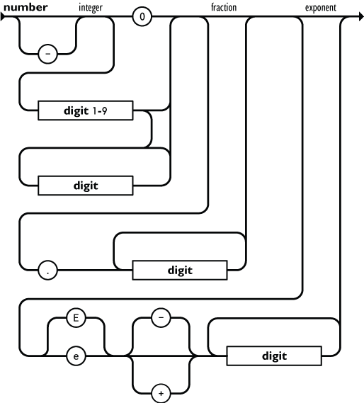
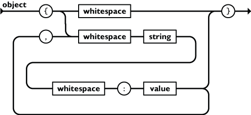
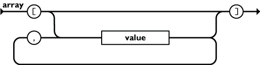
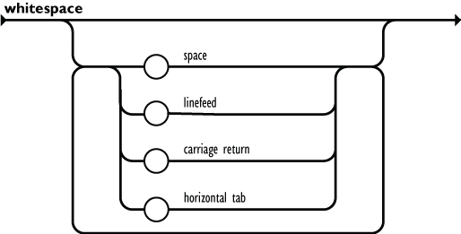

JSON data in Hat Open
=====================

:Author: Bozo Kopic
:Date: 2020-07-09
:Version: 1

This article gives short introduction to JSON, YAML, JSON Schema, `hat-core`
implementation (`hat.util.json`) and workflow for efficient
utilization of these technologies.

JSON
----

`JSON <https://json.org>`_ is modern data encoding format widely used by large
number of applications independently of target platforms and across different
domains. Some of the major factors responsible for it's popularity are:

    * simple definition
    * easy implementation
    * support and integration with most of popular programming languages
    * human readability and writability
    * optimal coder/decoder implementations
    * good balance between small number of data types and wide usability
    * dynamic data structures
    * self describable data

Because of this characteristics, `hat-core` also utilizes JSON as data encoding
in multiple scenarios. Two of the most common are web based client-server
communication data and configuration data.

Configuration data is good example of data structures where required
characteristics meet those provided by JSON encoding (human
readability/writability, dynamic extendable data structures). Flexible
encoders/decoders usually support direct mapping between JSON data structures
and data structures native to target programming language. This characteristics
enable fast prototyping of application core functionality while marginalizing
effort required for implementation of additional features as configuration
parsing.

.. note::

    Images origin `<https://json.org>`_

YAML
----

`YAML <https://yaml.org>`_ is another data encoding format similar to JSON.
It provides greater number of different encoding styles and advanced
interpretation directives which can be used to further enhance human
readability/writability provided by JSON format.

.. warning::

    `hat-core` utilizes subset of YAML which provides encoding limited to JSON
    data. More `advanced` features, and those not consistently implemented
    between different library implementations, should be avoided.

Example of same JSON data encoding with JSON and YAML:

    * JSON::

        {"lorem": "ipsum dolor sit amet",
         "consectetur": ["adipiscing", "elit"],
         "sed": "do eiusmod tempor incididunt ut labore et dolore magna aliqua",
         "other": [true, false, null, 42]}

    * YAML::

        lorem: ipsum dolor sit amet
        consectetur:
            - adipiscing
            - elit
        sed: |
            do eiusmod tempor incididunt ut labore et dolore magna aliqua
        other:
            - true
            - false
            - null
            - 42

`hat.util.json`
---------------

`hat-core` provides Python module `hat.util.json` as part of
`hat-util package <https://pypi.org/project/hat-util>`_. This module contains
generic functions operating on JSON data:

    * `hat.util.json.Data`

        Python data subset which can be encoded/decoded as JSON data.

    * `hat.util.json.encode` / `hat.util.json.decode`

        Encoding/decoding functions for conversion between supported JSON data
        and encoded string representation. These functions provide seamless
        encoding for both JSON and YAML formats.

    * `hat.util.json.encode_file` / `hat.util.json.decode_file`

        Functions similar to previous `encode` / `decode` functions operating
        with files. Encoding format (JSON or YAML) can be explicitly set or
        determined by file path extension.

    * `hat.util.json.SchemaRepository`

        JSON Schema validator (explanation in following chapters).

    * `hat.util.json.diff` / `hat.util.json.patch`

        JSON patch functions (explanation in following chapters).

Example of encoding/decoding JSON data:

.. code:: python

    from hat.util import json

    data = {'lorem': 'ipsum dolor sit amet',
            'consectetur': ['adipiscing', 'elit'],
            'sed': 'do eiusmod tempor incididunt ut labore et dolore magna aliqua',
            'other': [True, False, None, 42]}

    data_json = r"""
        {"lorem": "ipsum dolor sit amet",
         "consectetur": ["adipiscing", "elit"],
         "sed": "do eiusmod tempor incididunt ut labore et dolore magna aliqua",
         "other": [true, false, null, 42]}
    """

    data_yaml = r"""
        lorem: ipsum dolor sit amet
        consectetur:
            - adipiscing
            - elit
        sed: |
            do eiusmod tempor incididunt ut labore et dolore magna aliqua
        other:
            - true
            - false
            - null
            - 42
    """

    assert json.decode(json.encode(data)) == data
    assert json.decode(data_json, format=json.Format.JSON) == data
    assert json.decode(data_yaml, format=json.Format.YAML) == data

JSON Schema
-----------

`JSON Schema <https://json-schema.org>`_ provides set of rules which can be used
for describing and validating JSON data. JSON Schema is itself represented as
JSON data which is easily readable by both humans and machines.

By using JSON Schema for describing structure of JSON data, each application
that interacts with instances of described data structures can automatically
validate data and therefor decries complexity of application code by removing
"manual" validation checks.

Benefit of using JSON Schema is also availability of clean and precise
documentation of data structures which becomes part of main interface between
different system component. This strict definition enables cooperation between
team members during development of interconnected applications and benefits
future application maintenance.

Together with definition of data structures, JSON Schema provides unique
identification of each data structure definition which can be organized in
arbitrarily complex structures inside single file or split into multiple
files. By providing unique identification and possibility of referencing
previously defined data definitions, JSON Schema enables hierarchical
definition of complex data structures with emphasis on code re-usability.

Exact definition describing JSON Schema can be obtained on
`<https://json-schema.org/specification.html>`_. `hat-core` usually uses
smaller basic subset of all validation rules which provides enough means for
exactly describing data but at the same time provides clear and easily
understood documentation. All schemas are available in repository's
folder `schemas_json` and are organized in multiple files according to
schema identifiers.

Example of JSON Schema that defines structure of JSON Schema::

    {
        "$schema": "http://json-schema.org/draft-07/schema#",
        "$id": "http://json-schema.org/draft-07/schema#",
        "title": "Core schema meta-schema",
        "definitions": {
            "schemaArray": {
                "type": "array",
                "minItems": 1,
                "items": { "$ref": "#" }
            },
            "nonNegativeInteger": {
                "type": "integer",
                "minimum": 0
            },
            "nonNegativeIntegerDefault0": {
                "allOf": [
                    { "$ref": "#/definitions/nonNegativeInteger" },
                    { "default": 0 }
                ]
            },
            "simpleTypes": {
                "enum": [
                    "array",
                    "boolean",
                    "integer",
                    "null",
                    "number",
                    "object",
                    "string"
                ]
            },
            "stringArray": {
                "type": "array",
                "items": { "type": "string" },
                "uniqueItems": true,
                "default": []
            }
        },
        "type": ["object", "boolean"],
        "properties": {
            "$id": {
                "type": "string",
                "format": "uri-reference"
            },
            "$schema": {
                "type": "string",
                "format": "uri"
            },
            "$ref": {
                "type": "string",
                "format": "uri-reference"
            },
            "$comment": {
                "type": "string"
            },
            "title": {
                "type": "string"
            },
            "description": {
                "type": "string"
            },
            "default": true,
            "readOnly": {
                "type": "boolean",
                "default": false
            },
            "examples": {
                "type": "array",
                "items": true
            },
            "multipleOf": {
                "type": "number",
                "exclusiveMinimum": 0
            },
            "maximum": {
                "type": "number"
            },
            "exclusiveMaximum": {
                "type": "number"
            },
            "minimum": {
                "type": "number"
            },
            "exclusiveMinimum": {
                "type": "number"
            },
            "maxLength": { "$ref": "#/definitions/nonNegativeInteger" },
            "minLength": { "$ref": "#/definitions/nonNegativeIntegerDefault0" },
            "pattern": {
                "type": "string",
                "format": "regex"
            },
            "additionalItems": { "$ref": "#" },
            "items": {
                "anyOf": [
                    { "$ref": "#" },
                    { "$ref": "#/definitions/schemaArray" }
                ],
                "default": true
            },
            "maxItems": { "$ref": "#/definitions/nonNegativeInteger" },
            "minItems": { "$ref": "#/definitions/nonNegativeIntegerDefault0" },
            "uniqueItems": {
                "type": "boolean",
                "default": false
            },
            "contains": { "$ref": "#" },
            "maxProperties": { "$ref": "#/definitions/nonNegativeInteger" },
            "minProperties": { "$ref": "#/definitions/nonNegativeIntegerDefault0" },
            "required": { "$ref": "#/definitions/stringArray" },
            "additionalProperties": { "$ref": "#" },
            "definitions": {
                "type": "object",
                "additionalProperties": { "$ref": "#" },
                "default": {}
            },
            "properties": {
                "type": "object",
                "additionalProperties": { "$ref": "#" },
                "default": {}
            },
            "patternProperties": {
                "type": "object",
                "additionalProperties": { "$ref": "#" },
                "propertyNames": { "format": "regex" },
                "default": {}
            },
            "dependencies": {
                "type": "object",
                "additionalProperties": {
                    "anyOf": [
                        { "$ref": "#" },
                        { "$ref": "#/definitions/stringArray" }
                    ]
                }
            },
            "propertyNames": { "$ref": "#" },
            "const": true,
            "enum": {
                "type": "array",
                "items": true,
                "minItems": 1,
                "uniqueItems": true
            },
            "type": {
                "anyOf": [
                    { "$ref": "#/definitions/simpleTypes" },
                    {
                        "type": "array",
                        "items": { "$ref": "#/definitions/simpleTypes" },
                        "minItems": 1,
                        "uniqueItems": true
                    }
                ]
            },
            "format": { "type": "string" },
            "contentMediaType": { "type": "string" },
            "contentEncoding": { "type": "string" },
            "if": { "$ref": "#" },
            "then": { "$ref": "#" },
            "else": { "$ref": "#" },
            "allOf": { "$ref": "#/definitions/schemaArray" },
            "anyOf": { "$ref": "#/definitions/schemaArray" },
            "oneOf": { "$ref": "#/definitions/schemaArray" },
            "not": { "$ref": "#" }
        },
        "default": true
    }

JSON Schema Repository
----------------------

`hat.util.json.SchemaRepository` provides JSON Schema parser and JSON data
validator. Implementation of this class is based on
`jsonschema <https://github.com/Julian/jsonschema>`_ package.

Instances of this class are initiated from multiple sources of JSON Schema
data. Types of JSON Schema data sources are:

    * file path (`pathlib.PurePath`)

        * path to `.json` file

            JSON Schema encoded as JSON.

        * path to `.yaml` or `.yml` file

            JSON Schema encoded as YAML.

        * path to directory

            Referenced directory is recursively searched for all `.json`,
            `.yaml` and `.yml` files which are read and interpreted as JSON
            Schemas.

    * `hat.util.json.Data`

        Python data representing JSON data which defines JSON Schema.

    * `hat.util.json.SchemaRepository`

        Other instances of `SchemaRepository` can be used as parts of
        new `SchemaRepository` instances.

Additionally, each instance of `SchemaRepository` can be serialized as
JSON data with method `SchemaRepository.to_json`. This enables efficient
storage of whole repository content as single file which can be later used
for reconstruction of repository with static method
`SchemaRepository.from_json`.

Once instance of repository is initialized, method `validate` can be used for
validation of JSON data.

Using `SchemaRepository`
------------------------

For conviniance and easier re-usability, most of JSON Schemas used in
`hat-core` are written as YAML files hierarchically organized in single root
directory. In `hat-core` repository this folder is `schemas_json`. This schemas
are redistributed as part of appropriate python packages.

In most projects that use installed `hat-util` package, `SchemaRepository`
can be used as:

.. code:: python

    from pathlib import Path
    from hat.util import json

    json.json_schema_repo.validate('hat://logging.yaml#', {'version': 1})

If additional JSON Schemas, which are not part of installed `hat-core`
packages, are required, new instances of `SchemaRepository` can be created.

.. code:: python

    from pathlib import Path
    from hat.util import json

    schema_yaml = r"""
    "$schema": "http://json-schema.org/schema#"
    id: "abc://xyz#"
    type: object
    required:
        - log
        - value
    properties:
        log:
            "$ref": "hat://logging.yaml#"
        value:
            type: string
    """

    schema = json.decode(schema_yaml, format=json.Format.YAML)

    repo = json.SchemaRepository(schema, json.json_schema_repo)

    repo.validate('abc://xyz#', {'log': {'version': 1}, 'value': 'test'})

JSON patch
----------

.. todo::

    ...
